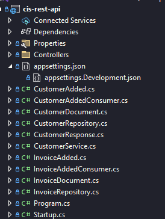
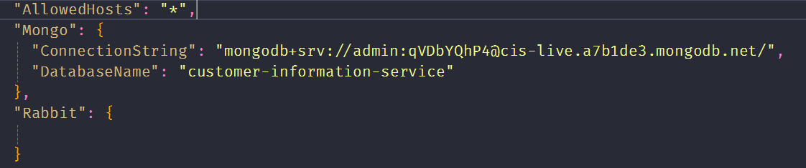
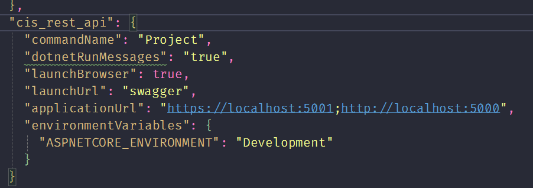

# Generic Comments

This document will entail all the generic comments about the codebase that was sent for the review task.

## Project Structure

Overall, the project folder structure looks a bit messy for me. Its good that he has separate files for services, consumers etc. But I think they can be arranged in such a way:

- `Models`
  - `CustomerAdded.cs`
  - `InvoiceAdded.cs`
- `Repositories`
  - `CustomerRepository.cs`
  - `InvoiceRepository.cs`
- `Documents`
  - `CustomerDocument.cs`
  - `InvoiceDocument.cs`

  And so on. Thus, the project would be much more easy to follow for someone coming to this code later on. Rather than having everything in the root. 
  
  

## Configuration Files

- `appsettings.json`

  - Since, this api will be consumed by some other services, I think for security reasons, some specific hosts should be allowed, rather than all. `AllowedHosts: "*"`

  - `Rabbit` is empty.

    

- `launchsettings.json` 
  
  This file is OK except the value for `cis_rest_api.dotnetRunMessages`. It takes a Boolean value but string given.

  
